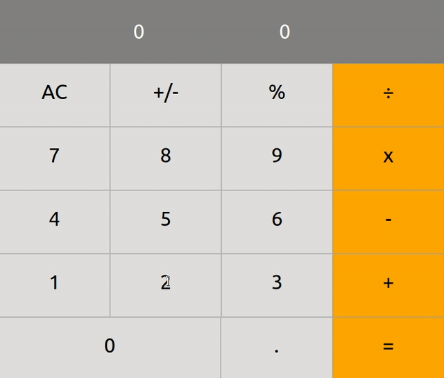

# React Calculator

 A classic calculator with the most common operations for daily life 

## Demo

## [Live Version](https://ivanderlich-calculator.herokuapp.com/)

## Instalation

    git clone https://github.com/IvanDerlich/Calculator

    cd Calculator

    npm install

    npm start

## Technologies used

<ul id="tech-list-fakebook">
  <li>React</li>
</ul>

## Author

[Ivan Derlich](https://www.ivanderlich.com)

## Ackownledgments
  
- [Microverse](https://www.microverse.org/):   This project is part of the Microverse JavaScript curriculum! They checked our code in [this](https://github.com/SantiagoGuerra/to-do/pull/1) pull request.
- The builders of the technologies we take for granted while programming applications like this one.

## Project Milestones

- 1: 
  - https://github.com/microverseinc/project-react-calculator/blob/master/milestones/MILESTONE_1.md
  - https://microverse.pathwright.com/library/fast-track-curriculum/69047/path/step/44896085/
- 2: 
  - https://github.com/microverseinc/project-react-calculator/blob/master/milestones/MILESTONE_2.md
  - https://microverse.pathwright.com/library/fast-track-curriculum/69047/path/step/44896092/
- 3: 
  - https://github.com/microverseinc/project-react-calculator/blob/master/milestones/MILESTONE_3.md
  - https://microverse.pathwright.com/library/fast-track-curriculum/69047/path/step/44896093/
- 4: 
  - https://github.com/microverseinc/project-react-calculator/blob/master/milestones/MILESTONE_4.md
  - https://microverse.pathwright.com/library/fast-track-curriculum/69047/path/step/44896094/
- 5: 
  - https://github.com/microverseinc/project-react-calculator/blob/master/milestones/MILESTONE_5.md
  - https://microverse.pathwright.com/library/fast-track-curriculum/69047/path/step/44896095/

## [Repository](https://github.com/IvanDerlich/Calculator)

